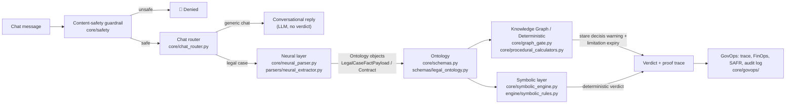

# Mega AI — Singapore Neuro-Symbolic Legal Control Plane Chatbot

A production-grade demonstration of a **true neuro-symbolic AI architecture**
for Singapore common law and statutory compliance reasoning, wrapped in a
real-time chatbot interface with full **GovOps runtime governance**. It
strictly separates:

- **Neural Semantic Parsing** (LLM) — extracts structured facts only, never a legal verdict.
- **Knowledge Graph Context** (Neo4j / NetworkX) — filters out overruled precedents (*stare decisis*) before reasoning.
- **Declarative Symbolic Deduction** (`pyDatalog` + a plain-Python rules engine) — the *only* components allowed to decide legal outcomes.
- **Procedural Math** — exact calendar arithmetic for limitation periods.
- **GovOps Runtime Governance** — OpenTelemetry distributed tracing with W3C `traceparent` propagation, FinOps token/cost tracking with circuit breakers, iteration caps, and a MAS SAFR disposition envelope (`AUTO_EXECUTE` / `OBSERVE` / `ESCALATE` / `DENY`).
- **Chatbot safety & routing** — every message is screened by a content-safety guardrail before anything else runs, and is routed to either the deterministic legal pipeline or a generic conversational reply.

## Architecture layers & how they interact

Each layer has its own README with full detail. This section is the map
between them:

| Layer | README | One-line job |
| --- | --- | --- |
| Neural (perception) | [docs/architecture/NEURAL_LAYER.md](docs/architecture/NEURAL_LAYER.md) | Text → typed facts (never a verdict) |
| Ontology | [docs/architecture/ONTOLOGY.md](docs/architecture/ONTOLOGY.md) | The shared schema every other layer reads/writes |
| Knowledge Graph / Deterministic | [docs/architecture/KNOWLEDGE_GRAPH_LAYER.md](docs/architecture/KNOWLEDGE_GRAPH_LAYER.md) | Precedent context filtering + calendar math |
| Symbolic (deduction) | [docs/architecture/SYMBOLIC_LAYER.md](docs/architecture/SYMBOLIC_LAYER.md) | The only layer allowed to produce a verdict |



The **ontology is the contract** between the neural and symbolic layers:
the neural layer can only populate fields the ontology defines, and the
symbolic layer can only reason over fields the ontology defines — so
neither layer can silently drift out of sync with the other.

## Architectural principles

1. **No LLM reasoning.** The LLM (System 1) only performs semantic fact
   parsing into a Pydantic schema. It is forbidden from deciding duty of
   care, validity of clauses, right to terminate, or remedies.
2. **True declarative deduction.** All legal reasoning is executed by
   `pyDatalog` Horn clauses ($A \Leftarrow B \land C$) — not procedural
   `if/else` and not LLM prompting.
3. **Knowledge graph is context, not reasoning.** The precedent graph
   prunes `OVERRULED` judgments from the reasoning context.
4. **Open-textured decomposition (UCTA reasonableness).**
   - Tier 1: UCTA s.2(1) automatically voids exclusions for death/personal injury.
   - Tier 2: UCTA Schedule 2 property/economic-loss exclusions are evaluated via a declarative multi-factor scoring rule.
5. **Spandeck 2-stage tort test.** Encodes *Spandeck Engineering v AGC*
   [2007] 4 SLR(R) 100 as formal Datalog axioms for duty-of-care evaluation.
6. **RDC Concrete term classification.** Encodes *RDC Concrete Pte Ltd v
   Sato Kogyo (S) Pte Ltd* [2007] 4 SLR(R) 413 — only a breach of
   condition (or an innominate term causing substantial deprivation)
   grounds a right to terminate; any recognized breach grounds damages.
7. **GovOps containment.** Every chat turn is wrapped in a root
   OpenTelemetry span, propagates W3C trace context to each worker step,
   tracks token spend against a circuit-breaker budget, enforces a hard
   iteration cap per conversation, and risk-gates the extracted payload
   through a MAS SAFR envelope before symbolic deduction runs.
8. **Safety before anything else.** `core/safety/content_moderation.py`
   screens every message before the router, neural parser, or symbolic
   engine ever see it.
9. **Open-world handling, not silent force-fitting.** Singapore law
   isn't a closed set of statutes — `core/domain_router.py` explicitly
   classifies which known rule domains a case engages, and if it
   engages *none* of them, the pipeline reports `UNMAPPED_DOMAIN` and
   escalates for HITL review with an explicitly labeled provisional LLM
   draft (`core/provisional_analysis.py`), instead of silently
   returning an empty/all-false verdict from irrelevant rule modules.
10. **Stateful multi-turn HITL follow-ups.** `core/followup_intent.py`
    detects short follow-up instructions ("what if Client C had access
    to trade secrets?") and re-evaluates the *previous* turn's payload
    with the patched fact, instead of re-parsing a brand new case from
    an incomplete follow-up message.

## Validation: Why Symbolic Rules + Smaller Datasets

```text
[Small Dataset] ──► [LLM / Small Fine-Tuned Model] ──► [Structured Legal Schema (Ontology)]
                                                                    │
                                                                    ▼
[Statutory Rules / Logic] ───────────────────────────► [Deterministic Rule Engine] ──► [100% Verifiable Verdict]
```

1. **High sample efficiency** — the neural layer only extracts a
   handful of shallow fields per clause (e.g. `clause_type`,
   `duration_months`, `jurisdiction`, `scope`, `geography`), not
   end-to-end legal reasoning, so it needs far less training/prompting
   data than a model asked to "learn" statutory limits directly.
2. **Zero-data rule updates** — when a statute or precedent changes,
   the rule table/Horn clause is edited directly (see
   [`engine/symbolic_rules.py`](engine/symbolic_rules.py)); nothing is
   retrained, and every future extraction is evaluated against the new
   rule with 100% consistency.
3. **Mathematical precision & auditability** — typed, bounded ontology
   fields make rule conditions exact, and every rule evaluation is
   traced back to its source clause (see
   [`audit/proof_tracer.py`](audit/proof_tracer.py)).

See [docs/architecture/ONTOLOGY.md](docs/architecture/ONTOLOGY.md) for
how this project relates to Singapore's open-source legal computation
ecosystem — **L4 / SMU CCLAW**, **SOLID (SMU/MinLaw)** — and the
international **LKIF** and **SALI** ontology frameworks.

## Project structure

```text
├── app.py                         # Streamlit real-time legal chatbot
├── core/
│   ├── schemas.py                 # Pydantic contracts (facts + GovOps audit record)
│   ├── neural_parser.py           # Groq (free) / OpenAI / Anthropic / offline mock fact extractor
│   ├── chat_router.py             # Legal-case vs. generic-chat routing + generic LLM reply
│   ├── domain_router.py           # Classifies known rule domains / flags UNMAPPED_DOMAIN
│   ├── provisional_analysis.py    # Labeled provisional LLM draft for unmapped-domain escalations
│   ├── followup_intent.py         # Multi-turn HITL fact-patch detector ("what if X?")
│   ├── graph_gate.py              # Neo4j/NetworkX precedent hierarchy gate
│   ├── symbolic_engine.py         # pyDatalog engine (Spandeck, UCTA, RDC Concrete, restraint of trade)
│   ├── procedural_calculators.py  # Limitation Act 1959 + Denka Advantech penalty calendar/numeric math
│   ├── response_renderer.py       # Deterministic plain-English verdict formatting
│   ├── safety/
│   │   └── content_moderation.py  # Harmful-content guardrail (OpenAI moderation + offline fallback)
│   └── govops/
│       ├── tracer.py              # OpenTelemetry spans & W3C traceparent propagation
│       ├── finops.py              # Token accounting, cost calc, circuit breaker, iteration cap
│       ├── extraction_validator.py # Flags neural-extraction/raw-text contradictions
│       └── safr_envelope.py       # MAS SAFR runtime disposition (ALLOW/DENY/ESCALATE)
├── schemas/
│   └── legal_ontology.py          # Jurisdiction-agnostic Contract/Clause/Entity/Obligation ontology
├── parsers/
│   └── neural_extractor.py        # Perception layer targeting schemas/legal_ontology.py
├── engine/
│   └── symbolic_rules.py          # Deterministic rule table (e.g. non-compete duration caps)
├── audit/
│   └── proof_tracer.py            # Links every rule evaluation back to its source clause/line
├── docs/architecture/
│   ├── NEURAL_LAYER.md
│   ├── SYMBOLIC_LAYER.md
│   ├── ONTOLOGY.md
│   └── KNOWLEDGE_GRAPH_LAYER.md
├── deployment/
│   ├── deploy_azure.sh            # Azure Container Apps deployment
│   └── deploy_gcp.sh              # Google Cloud Run deployment
├── Dockerfile
└── tests/
    ├── test_spandeck_rules.py
    ├── test_ucta_rules.py
    ├── test_full_pipeline.py
    ├── test_govops_telemetry.py         # Tracer, FinOps ledger, SAFR envelope
    ├── test_aircon_dispute_pipeline.py  # End-to-end aircon lease dispute demo
    ├── test_content_moderation.py       # Content-safety guardrail
    ├── test_chat_router.py              # Legal-case vs. generic-chat classifier
    └── test_ontology_pipeline.py        # Non-compete duration cap end-to-end demo
```

## Setup

```powershell
python -m venv .venv
.\.venv\Scripts\Activate.ps1
pip install -r requirements.txt
Copy-Item .env.example .env   # optional: add GROQ_API_KEY (free) / OPENAI_API_KEY / ANTHROPIC_API_KEY
```

## Running the chatbot

```powershell
streamlit run app.py
```

Type a dispute scenario into the chat box (or click **Use sample aircon
dispute** for the built-in commercial lease / VRV aircon breakdown
example) — or just chat normally; every message is first screened by
the content-safety guardrail, then routed to either a generic
conversational reply or the full legal pipeline. Legal-case turns
render:

1. A plain-English legal advice summary (deterministically templated -
   never LLM-generated prose about the outcome).
2. A **Deterministic Verdict Card** (extracted facts, graph gate result,
   symbolic deduction, limitation check).
3. A **Symbolic Proof Trace** — the exact pyDatalog assert/deduce steps.
4. A **GovOps & Telemetry Panel** — trace ID, W3C `traceparent`, SAFR
   disposition/reasons, per-step token usage & cost, and the captured
   span tree.

A session-wide **audit log** (all turns, verdicts, and telemetry) can be
downloaded as JSON once you check the HITL approval box.

### General-purpose ontology demo (non-compete clauses)

The chatbot's Singapore tort/UCTA pipeline (`core/`) is complemented by
a jurisdiction-agnostic ontology pipeline demonstrating the same
neural-extraction-into-deterministic-rules pattern for a different
clause type (see [`tests/test_ontology_pipeline.py`](tests/test_ontology_pipeline.py)):

```python
from parsers.neural_extractor import extract_contract
from engine.symbolic_rules import evaluate_contract
from audit.proof_tracer import ProofTracer

contract = extract_contract("Non-compete clause, 24 months, Singapore.")
results = evaluate_contract(contract)          # duration cap check per jurisdiction
ProofTracer().trace_contract(contract, results)  # auditable proof steps
```

### Optional: real LLM parsing

By default the neural parser and the generic chat reply both use a
deterministic offline mock/canned fallback. Set one of these in the
environment to route through a live LLM instead (checked in this
order):

1. `GROQ_API_KEY` — **free tier**, OpenAI-compatible endpoint, model
   `llama-3.1-8b-instant`. Get a key at https://console.groq.com/keys.
2. `OPENAI_API_KEY` — `gpt-4o-mini`. Also enables the OpenAI moderation
   endpoint for the content-safety guardrail (otherwise it uses an
   offline regex fallback).
3. `ANTHROPIC_API_KEY` — `claude-3-5-sonnet-20241022`.

The system prompt still forbids the model from making legal judgments;
it only fills the `LegalCaseFactPayload` schema (or, for generic chat,
replies conversationally without ever stating a legal conclusion).

## Running tests

```powershell
pytest
```

## Deployment

See [DEPLOYMENT.md](DEPLOYMENT.md) for local, Azure Container Apps, and
Google Cloud Run deployment steps.

## Legal disclaimer

This is a technical demonstration only. It does not constitute legal advice
and the sample rules are simplified for illustrative purposes.
