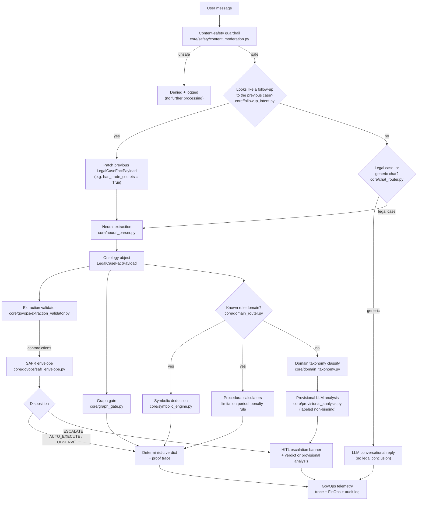
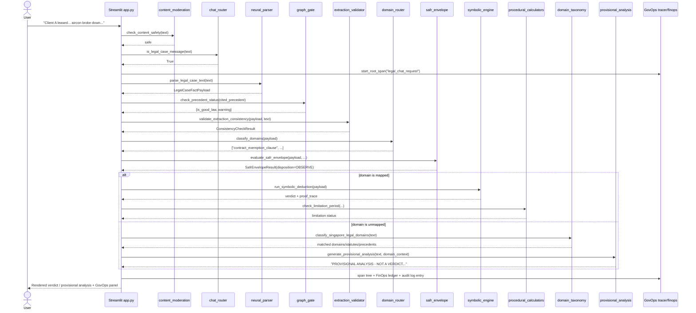

# Demo Script: Architecting a Neuro-Symbolic Legal Control Plane

A presenter's script for demoing **Mega AI — Singapore Legal Control
Plane**, plus a generalizable blueprint for architecting this class of
system (neural perception + deterministic symbolic deduction + GovOps)
for *any* regulated domain, not just law.

---

## 1. Elevator pitch (30 seconds)

> "Most 'AI legal assistants' ask an LLM to read a contract and state
> whether it's enforceable. That's a hallucination risk on every single
> answer. This system never lets the LLM decide an outcome — it only
> extracts facts. A deterministic rule engine (`pyDatalog` Horn clauses
> + plain Python) makes the actual legal call, with a full auditable
> proof trace. When a case falls outside the rules we've implemented,
> the system says so explicitly and escalates to a human — it never
> silently guesses."

---

## 2. Architecture blueprint (generalizable to any domain)

This is the reusable recipe, independent of Singapore law specifically.
Swap "legal" for "clinical", "tax", "insurance underwriting", etc. and
the same six steps apply.

| Step | What you build | This repo's example |
| --- | --- | --- |
| 1. Define the ontology | A typed schema (Pydantic/dataclasses) that is the *only* vocabulary every other layer speaks | `core/schemas.py`, `schemas/legal_ontology.py` |
| 2. Build the neural perception layer | An LLM (or small fine-tuned model) that fills the ontology's fields *only* — never a verdict | `core/neural_parser.py`, `parsers/neural_extractor.py` |
| 3. Build the deterministic rule engine | Horn clauses / a rules table over the ontology's fields — the only component allowed to produce an outcome | `core/symbolic_engine.py`, `engine/symbolic_rules.py` |
| 4. Add context-filtering layers | Deterministic (non-LLM) lookups that narrow what's relevant before/alongside deduction (precedent graphs, calendar math, numeric thresholds) | `core/graph_gate.py`, `core/procedural_calculators.py` |
| 5. Classify domain coverage explicitly | A router that says "yes, we have rules for this" or "no, escalate" — never silently defaults to an unrelated rule | `core/domain_router.py`, `core/domain_taxonomy.py` |
| 6. Wrap it all in GovOps | Tracing, cost accounting, circuit breakers, and a risk envelope that gates every stage | `core/govops/` |

**The one rule that makes this safe:** the LLM is *only* allowed to
touch two things — extracting facts (step 2), and drafting an
explicitly-labeled, non-binding provisional analysis when step 5 says
"no rule coverage" (`core/provisional_analysis.py`). It is never
allowed to decide an outcome when a deterministic rule exists.

---

## 3. Data flow diagrams

### 3.1 High-level pipeline (per chat turn)

### 3.2 Sequence diagram (a single "legal case" turn)

---

## 4. Live demo script

Run `streamlit run app.py` (see [DEPLOYMENT.md](../DEPLOYMENT.md) for
local/Azure/GCP steps) and walk through these five scenarios in order:

### Demo 1 — Fully deterministic pipeline (aircon lease dispute)
Click **"Use sample aircon dispute"**. Narrate as it renders:
- **Stage 1**: extracted facts (warranty breach, exemption clause,
  unequal bargaining, S$45,000 claim).
- **Stage 2**: graph gate resolves *RDC Concrete* as good law.
- **Stage 3**: proof trace shows the exact `ASSERT`/`DEDUCE` steps for
  UCTA Schedule 2 and the RDC Concrete term classification.
- **GovOps panel**: trace ID, `traceparent`, FinOps cost, SAFR
  `OBSERVE` (high-value claim, but confident + mapped domain).

### Demo 2 — Multi-rule pipeline (restraint of trade + penalty)
Click **"Use sample restraint-of-trade dispute"**. Point out:
- Two precedents extracted from one "Governing Frameworks" paragraph
  (`cited_precedent` + `additional_precedents`).
- Both the *Man Financial* restraint-of-trade rule (void — no
  legitimate interest for a junior role) and the *Denka Advantech*
  penalty rule (extravagant vs. salary) fire in the same turn.
- The Spandeck tort line is **absent** — no `injury_type` was
  extracted, so the renderer doesn't inject irrelevant noise.

### Demo 3 — Stateful multi-turn follow-up
After Demo 2, type: *"What if Client C had access to TechCorp's
proprietary source code?"* Show:
- `core/followup_intent.py` detects this as a fact patch
  (`has_trade_secrets_or_confidential_info -> True`) rather than a
  fresh case.
- The response re-evaluates the *same* case: restraint of trade may
  now have a legitimate interest, but the 24-month APAC scope is still
  excessive.

### Demo 4 — Unmapped domain (open-world handling)
Type a family law or defamation scenario, e.g.: *"Client wants a
divorce and dispute over matrimonial assets under the Women's
Charter."* Show:
- `domain_router.is_unmapped_domain()` returns `True` (no tort/UCTA/RDC
  Concrete/restraint/penalty fields engaged).
- `domain_taxonomy.classify_singapore_legal_domains()` correctly tags
  this as `family_law` and surfaces the Women's Charter statute.
- SAFR disposition is `ESCALATE` with an `UNMAPPED_DOMAIN` flag, and
  the response is a clearly labeled **PROVISIONAL ANALYSIS — NOT A
  VERDICT — REQUIRES HUMAN LEGAL REVIEW** draft, not a fabricated
  verdict and not a silent Spandeck default.

### Demo 5 — Safety guardrail
Type an obviously harmful request. Show it gets blocked by
`check_content_safety()` before it reaches any LLM or symbolic stage,
with the moderation categories logged to the audit trail.

---

## 5. Extension recipe: adding a new domain

Using this repo as the reference implementation, adding real
deterministic coverage for domain *N+1* (e.g. `consumer_sale_of_goods`)
looks like:

1. **Extend the ontology** (`core/schemas.py`): add the handful of
   typed fields the new domain's rules actually need (e.g.
   `goods_satisfactory_quality: bool`, `goods_fit_for_purpose: bool`).
2. **Extend the mock extractor** (`core/neural_parser.py`): add
   keyword/regex detection for the new fields, mirroring the existing
   pattern (default to `False`/`None`, never force-fit).
3. **Add the Horn clause / rule table** (`core/symbolic_engine.py` or a
   new module under `engine/`): encode the statutory test as
   declarative rules, not `if/else` prose.
4. **Flip `implemented: true`** for the relevant sub-domain in
   [`core/data/singapore_legal_domains.json`](../core/data/singapore_legal_domains.json)
   and set `classify_domains()` in `core/domain_router.py` to detect it.
5. **Add tests** mirroring `tests/test_restraint_of_trade_and_penalty.py`
   — one deterministic unit test per rule outcome, plus one end-to-end
   test through the real parser.

No changes are needed to GovOps, the chat router, content moderation,
or the unmapped-domain fallback — they all operate generically over
whatever `classify_domains()` reports.

---

## 6. Appendix: file map

See the [main README's project structure](../README.md#project-structure)
for the full file tree, and the four per-layer READMEs for details:

- [docs/architecture/NEURAL_LAYER.md](architecture/NEURAL_LAYER.md)
- [docs/architecture/ONTOLOGY.md](architecture/ONTOLOGY.md)
- [docs/architecture/KNOWLEDGE_GRAPH_LAYER.md](architecture/KNOWLEDGE_GRAPH_LAYER.md)
- [docs/architecture/SYMBOLIC_LAYER.md](architecture/SYMBOLIC_LAYER.md)
